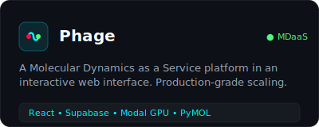
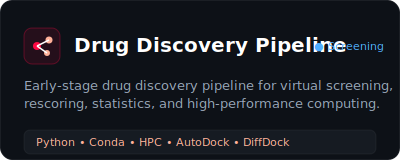
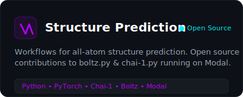
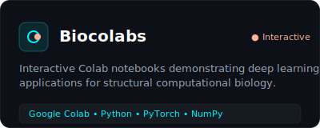

<!-- HERO BANNER -->

  

<!-- DIVIDER -->

  

<!-- INTRODUCTION -->
<table align="center" width="100%">
  <tr>
    <td>
      <h2 align="center">🧬 Biology • Chemistry • Computation</h2>
      

        Undergraduate B.Tech Student at <b>SASTRA Deemed University</b> with a focus on <b>AI + Bio</b>.
        A passionate developer and builder constructing production-grade molecular dynamics services,
        early-stage drug discovery pipelines, and AI-driven protein engineering workflows.
      

      

        <b>GATE Biotechnology 2026:</b> AIR 14 (Score 858) 🏆
      

      

        
        
        
      

    </td>
  </tr>
</table>

<!-- DIVIDER -->

  

<!-- TECH STACK -->
<h2 align="center">⚛️ Tech Stack &amp; Scientific Tools</h2>

  <!-- ML / Models -->
  
  
  
   
  <!-- MD Engines -->
  
  
  
  
   
  <!-- Vis & Platforms -->
  
  
  
   
  <!-- Dev & Languages -->
  
  
  
  
  

<!-- DIVIDER -->

  

<!-- SELECTED WORKS -->
<h2 align="center">🚀 Selected Projects &amp; Platforms</h2>

<table align="center" width="100%">
  <tr>
    <td width="50%" align="center">
      
    </td>
    <td width="50%" align="center">
      
    </td>
  </tr>
  <tr>
    <td width="50%" align="center">
      
    </td>
    <td width="50%" align="center">
      
    </td>
  </tr>
</table>

<!-- DIVIDER -->

  

<!-- RESEARCH & BUILD TIMELINE -->
<h2 align="center">🔬 Research &amp; Build Journey</h2>

  

<!-- DIVIDER -->

  

<!-- DUAL COLUMN LATEST ACTIVITY -->
<table width="100%">
  <tr>
    <!-- Publications -->
    <td width="50%" valign="top">
      <h3>📚 Publications &amp; Preprints</h3>
<!-- PUBLICATIONS:START -->
- 🧬 **[Structure-Based Drug Design of Novel Inhibitors Targeting the Thiamine Biosynthesis Pathway in Bacteria](https://www.biorxiv.org/)** <b>N. Krishna</b>, et al. • bioRxiv (Preprint)
<!-- PUBLICATIONS:END -->
    </td>
    <!-- Latest Repos -->
    <td width="50%" valign="top">
      <h3>📰 Latest Active Repositories</h3>
<!-- LATEST-REPOS:START -->
<table>
<tr><td width='65%'>🚀 <b><a href='https://github.com/greenrace666/greenrace666'>greenrace666</a></b> My profile README</td><td width='20%' align='center'><code>Misc</code></td><td width='15%' align='center'>⭐ 0</td></tr>
<tr><td width='65%'>🚀 <b><a href='https://github.com/greenrace666/websitecode'>websitecode</a></b> Created with StackBlitz ⚡️</td><td width='20%' align='center'><code>TypeScript</code></td><td width='15%' align='center'>⭐ 0</td></tr>
<tr><td width='65%'>🚀 <b><a href='https://github.com/greenrace666/blogsite'>blogsite</a></b> Created with StackBlitz ⚡️</td><td width='20%' align='center'><code>Astro</code></td><td width='15%' align='center'>⭐ 0</td></tr>
<tr><td width='65%'>🚀 <b><a href='https://github.com/greenrace666/nexttry'>nexttry</a></b> No description provided.</td><td width='20%' align='center'><code>Misc</code></td><td width='15%' align='center'>⭐ 0</td></tr>
</table>
<!-- LATEST-REPOS:END -->
    </td>
  </tr>
  <tr>
    <!-- Latest Blog Posts -->
    <td width="50%" valign="top">
      <h3>✍️ Notes from the Bench (Blog)</h3>
<!-- BLOG-POST-LIST:START -->
- ✍️ [How do you solve a problem ? And what can Github teach us about it](https://nikilblogs.netlify.app/posts/git/) (Jan 28, 2026)
- ✍️ [Why is a Fundamental Change in the Method of Education Required? And what can LLMs teach us about it](https://nikilblogs.netlify.app/posts/edu/) (Jan 24, 2026)
- ✍️ [2024 Ends](https://nikilblogs.netlify.app/posts/endof2024/) (Dec 30, 2024)
<!-- BLOG-POST-LIST:END -->
    </td>
    <!-- Contact Info -->
    <td width="50%" valign="top">
      <h3>📬 Connect &amp; Collaborate</h3>
      <ul>
        <li>📧 Email: <a href="mailto:126010091@sastra.ac.in">126010091@sastra.ac.in</a></li>
        <li>🌐 Website: <a href="https://nikilkrishna.netlify.app/">nikilkrishna.netlify.app</a></li>
        <li>✍️ Blog: <a href="https://nikilblog.netlify.app/">nikilblog.netlify.app</a></li>
        <li>💼 LinkedIn: <a href="https://www.linkedin.com/in/nikil-krishna-0b2a5b1bb/">nikil-krishna-0b2a5b1bb</a></li>
        <li>🐦 X / Twitter: <a href="https://x.com/bionikil">@bionikil</a></li>
      </ul>
    </td>
  </tr>
</table>

<!-- DIVIDER -->

  

<!-- GITHUB METRICS DASHBOARD -->
<h2 align="center">📊 GitHub Metrics &amp; Contribution Stats</h2>

  
  

  

<h3 align="center">🏆 GitHub Trophies</h3>

  

<!-- CONTRIBUTION SNAKE -->
<h3 align="center">🐍 Contribution Snake</h3>

  

